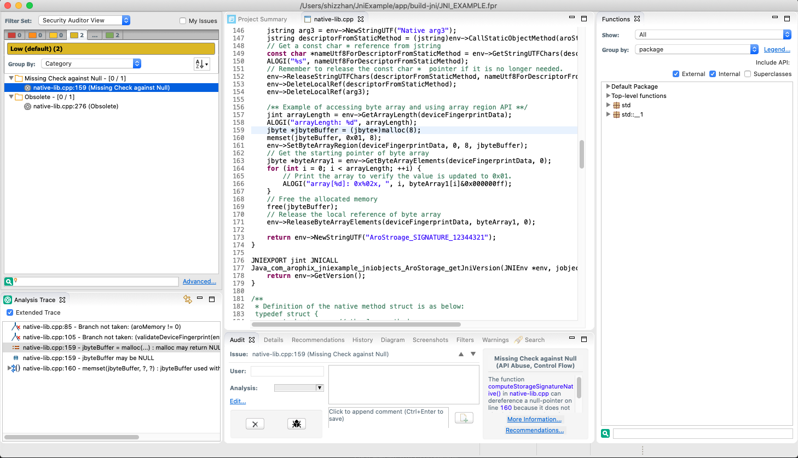

# JniExample & Using HP Fortify to Scan Android JNI C/C++ Code

This is a hands on JNI example project to help JNI developer. And also, I include the way how to do HP Fortify scanning for JNI C/C++ code.

* Blog: https://arophix.com/2017/12/17/andoid-jni-summary/

HP Fortify does not directly support scanning Android JNI code base, we need some customise steps to tell HP Fortify source analyser to generate the FPR report.

## Environment

* MacOS Catalina: 10.15.16
* HP Fortify Analyser **Fortify_SCA_and_Apps_20.1.0**
* Android NDK 21.0.6113669
* CMake 3.10.2.4988404
* Assume project name: JNI_EXAMPLE

## Create directory `fortify_tools`

This directory is at the same level as `JniExample/app/CMakeLists.txt`

## Create `fortify_tools/fortify_cc`

This is the **gcc** compiler wrapper which injects the `sourceanalyzer` command.

```bash
#!/bin/sh

SOURCEANALYZER=$HPFORTIFY_HOME/sourceanalyzer
MEMORY="-Xmx7270M -Xms400M -Xss24M "
PROJECTID="JNI_EXAMPLE"

$SOURCEANALYZER $MEMORY -b $PROJECTID gcc $@
```

## Create `fortify_tools/fortify_cxx`

This is the **g++** compiler wrapper which injects the `sourceanalyzer` command.

```bash
#!/bin/sh

SOURCEANALYZER=$HPFORTIFY_HOME/sourceanalyzer
MEMORY="-Xmx7270M -Xms400M -Xss24M "
PROJECTID="JNI_EXAMPLE"

$SOURCEANALYZER $MEMORY -b $PROJECTID g++ $@
```

## Change directory to dir `fortify_tools`

```bash
cd JniExample/app/fortify_tools
```

## Create `hpfortify_build` directory

```bash
rm -rf hpfortify_build
mkdir hpfortify_build
```

## Config cmake files using standalone CMake command

The standalone cmake build command can be found from file `JniExample/app/.cxx/cmake/release/x86/build_command.txt` which is generated after running below command

```bash
➜  JniExample ✗ ./gradlew :app:externalNativeBuildRelease
```

`build_command.txt` can be something similar as below

```bash
Executable : /Library/Android/sdk/cmake/3.10.2.4988404/bin/cmake
arguments : 
-H<your-working-home-dir>/JniExample/app
-DCMAKE_CXX_FLAGS=-std=c++11 -frtti -fexceptions
-DCMAKE_FIND_ROOT_PATH=<your-working-home-dir>/JniExample/app/.cxx/cmake/release/prefab/x86/prefab
-DCMAKE_BUILD_TYPE=Release
-DCMAKE_TOOLCHAIN_FILE=<your-working-home-dir>/Library/Android/sdk/ndk/21.0.6113669/build/cmake/android.toolchain.cmake
-DANDROID_ABI=x86
-DANDROID_NDK=<your-working-home-dir>/Library/Android/sdk/ndk/21.0.6113669
-DANDROID_PLATFORM=android-16
-DCMAKE_ANDROID_ARCH_ABI=x86
-DCMAKE_ANDROID_NDK=<your-working-home-dir>/Library/Android/sdk/ndk/21.0.6113669
-DCMAKE_EXPORT_COMPILE_COMMANDS=ON
-DCMAKE_LIBRARY_OUTPUT_DIRECTORY=<your-working-home-dir>/JniExample/app/build/intermediates/cmake/release/obj/x86
-DCMAKE_MAKE_PROGRAM=<your-working-home-dir>/Library/Android/sdk/cmake/3.10.2.4988404/bin/ninja
-DCMAKE_SYSTEM_NAME=Android
-DCMAKE_SYSTEM_VERSION=16
-B<your-working-home-dir>/JniExample/app/.cxx/cmake/release/x86
-GNinja
jvmArgs : 

Build command args:

```

According to above to create the host specific **CMake** command for generating cmakefiles. E.g. for my case, it is as below:

```bash
➜  build-jni git:(master) ✗ /Users/myname/Library/Android/sdk/cmake/3.10.2.4988404/bin/cmake -H/Users/myname/JniExample/app \
-DCMAKE_CXX_FLAGS=-std=c++11 -frtti -fexceptions \
-DCMAKE_FIND_ROOT_PATH=/Users/myname/JniExample/app/build-jni/.cxx/cmake/release/prefab/x86/prefab \
-DCMAKE_BUILD_TYPE=Release \
-DCMAKE_TOOLCHAIN_FILE=/Users/myname/Library/Android/sdk/ndk/21.0.6113669/build/cmake/android.toolchain.cmake \
-DANDROID_ABI=x86 \
-DANDROID_NDK=/Users/myname/Library/Android/sdk/ndk/21.0.6113669 \
-DANDROID_PLATFORM=android-16 \
-DCMAKE_ANDROID_ARCH_ABI=x86 \
-DCMAKE_ANDROID_NDK=/Users/myname/Library/Android/sdk/ndk/21.0.6113669 \
-DCMAKE_EXPORT_COMPILE_COMMANDS=ON \
-DCMAKE_LIBRARY_OUTPUT_DIRECTORY=/Users/myname/JniExample/app/build-jni/intermediates/cmake/release/obj/x86 \
-DCMAKE_MAKE_PROGRAM=/Users/myname/Library/Android/sdk/cmake/3.10.2.4988404/bin/ninja \
-DCMAKE_SYSTEM_NAME=Android \
-DCMAKE_SYSTEM_VERSION=16 \
-B/Users/myname/JniExample/app/build-jni/.cxx/cmake/release/x86 \
-GNinja ..
```

## Build project

```bash
cd JniExample/app/hpfortify_build
/Users/myname/Library/Android/sdk/cmake/3.10.2.4988404/bin/cmake --build .
```

## Manually change compiler

1. Go to directory `/Users/myname/JniExample/app/hpfortify_build/CMakeFiles/3.10.2`

2. Replace the C compiler inside `CMakeCCompiler.cmake`

    ```bash
    set(CMAKE_C_COMPILER "/Users/myname/JniExample/app/fortify_tools/fortify_cc")
    ```

3. Replace the CXX compiler inside`CMakeCXXCompiler.cmake`

    ```bash
    set(CMAKE_CXX_COMPILER "/Users/myname/JniExample/app/fortify_tools/fortify_cxx"))
    ```

## Rebuild project

```bash
/Users/myname/Library/Android/sdk/cmake/3.10.2.4988404/bin/cmake --build .
```

## Generate Fortify report

```bash
Applications/Fortify/Fortify_SCA_and_Apps_20.1.0/bin/sourceanalyzer -b JNI_EXAMPLE -scan -f JNI_EXAMPLE.fpr
```

## Automation

All of above manual steps can be automatically done with script [hpfortify_scan_native.sh](app/fortify_tools/hpfortify_scan_native.sh).

Run below command:

```bash
➜  fortify_tools git:(master) ✗ sh hpfortify_scan_native.sh
```

You will see the FPR file is generated under directory `app/fortify_tools/`.

## Screenshot for the report



## Some errors

**But this error does not really matter with report generation**, can simply ignore it.

* ld: unknown option:
  --sysroot=/Users/myname/Library/Android/ndk/android-ndk-r20b/toolchains/llvm/prebuilt/darwin-x86_64/sysroot

  ** [https://www.jianshu.com/p/f84dbf8ec147](https://www.jianshu.com/p/f84dbf8ec147)

  ** [https://gitlab.kitware.com/cmake/cmake/-/merge_requests/3606](https://gitlab.kitware.com/cmake/cmake/-/merge_requests/3606)

  ** [https://superuser.com/questions/1446914/ndk-r20-embedded-toolchain-fails-on-macos](https://superuser.com/questions/1446914/ndk-r20-embedded-toolchain-fails-on-macos)

    In short: The clang compiler provided by the NDK is using the linker from the linux host machine and not the linker provided by the NDK. The root cause is the `--gcc-toolchain=` path is incorrect because of `_ANDROID_TOOL_NAME` is not set via `Determine-Compiler-NDK.cmake` because of the missing `TOOLCHAIN_NAME` in `ndk-bundle/build/core/toolchains/arm-linux-androideabi-clang/setup.mk`.

## References

* [https://stackoverflow.com/questions/36428360/use-fortify-sourceanalyzer-with-cmake](https://stackoverflow.com/questions/36428360/use-fortify-sourceanalyzer-with-cmake)
* [https://stackoverflow.com/questions/34906024/how-do-i-force-cmake-to-use-cl-exe-without-full-path/36791990#36791990](https://stackoverflow.com/questions/34906024/how-do-i-force-cmake-to-use-cl-exe-without-full-path/36791990#36791990)
* [https://stackoverflow.com/questions/1867745/cmake-use-a-custom-linker](https://stackoverflow.com/questions/1867745/cmake-use-a-custom-linker)
